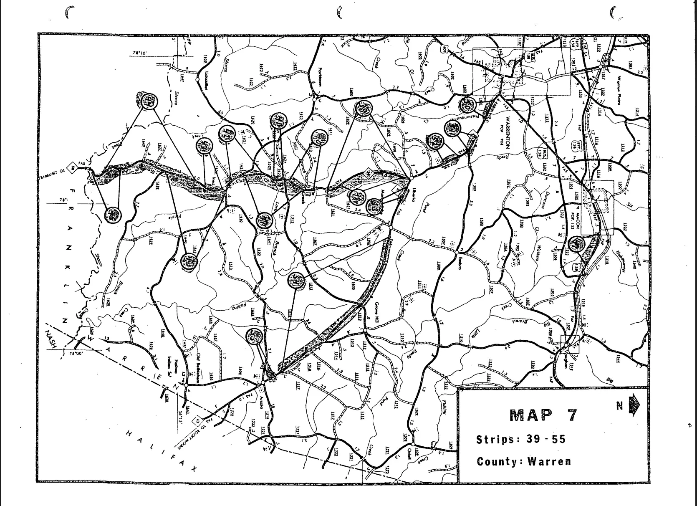
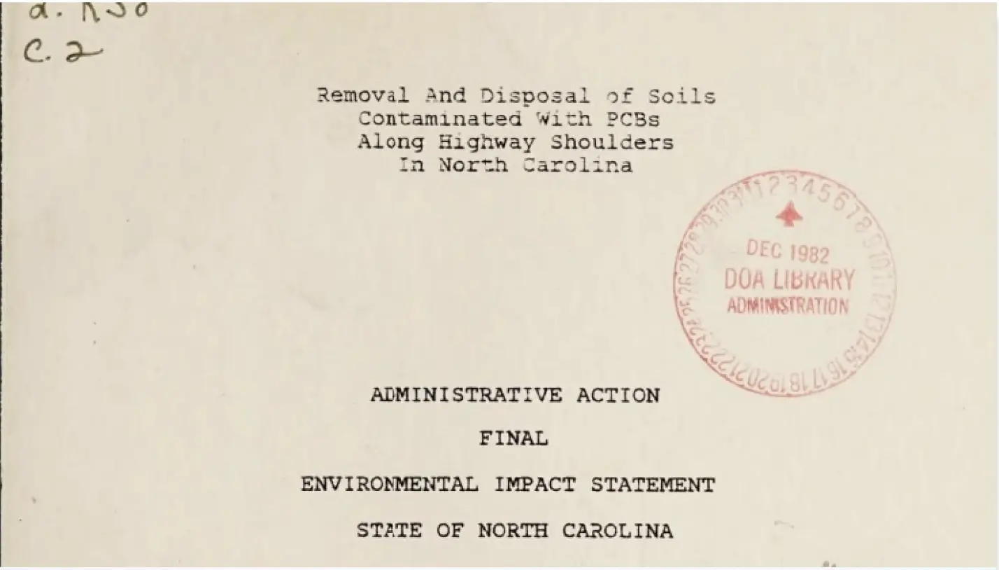
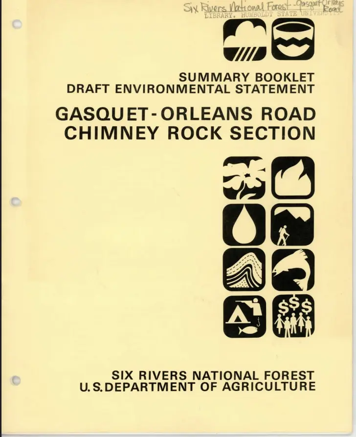
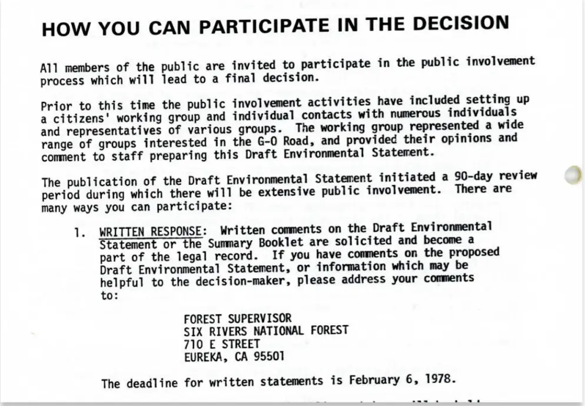
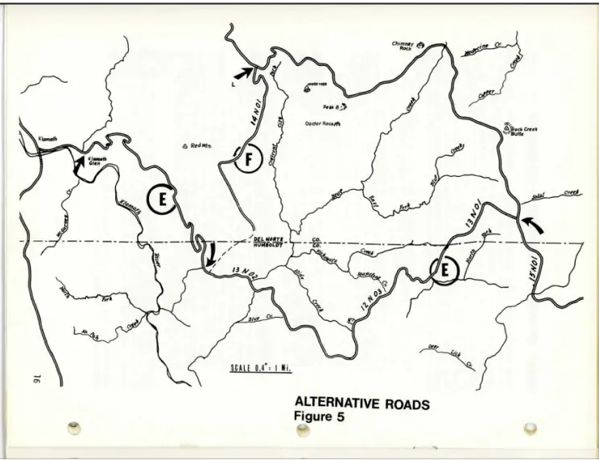
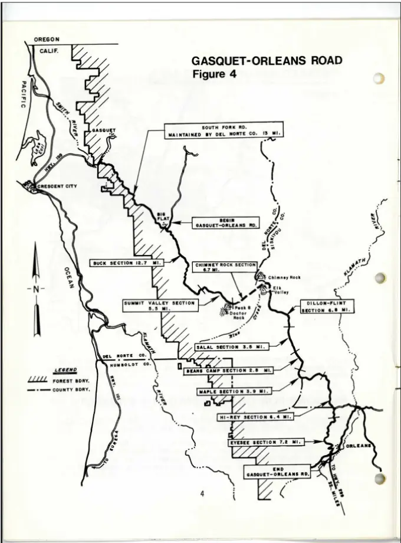
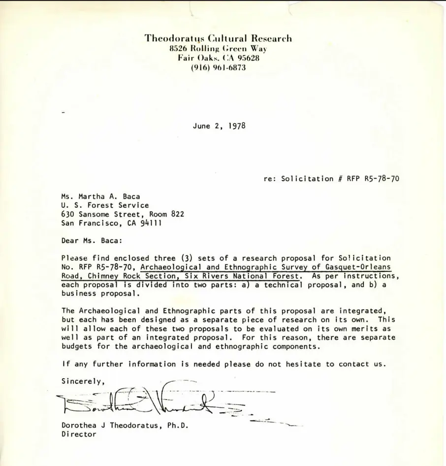
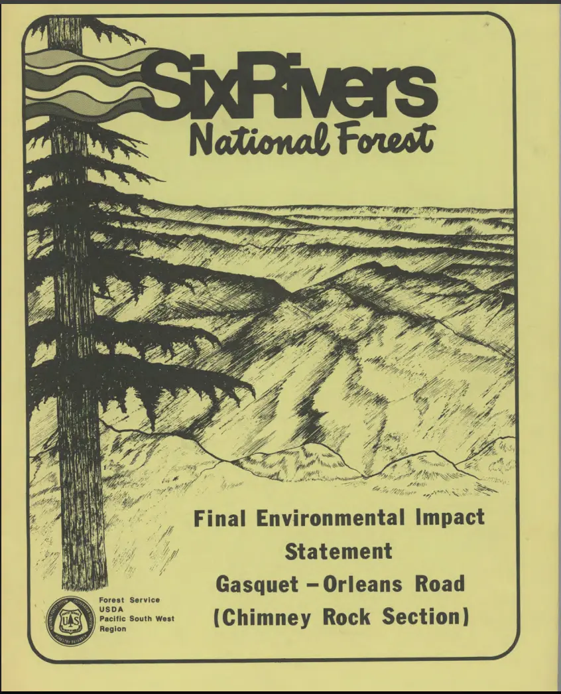
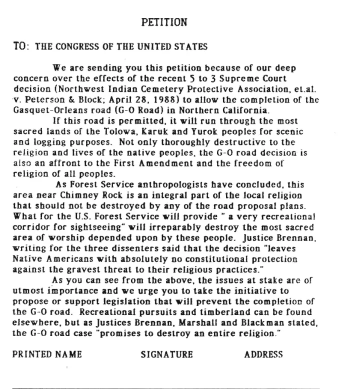

<EISAnnotations />

<header id="invisible-hazards-banner" className="banner-image">
  

    <h1>The Impacts that Matter:</h1>
    <h1>Environmental Justice Through EIS</h1>
    

      Which communities bear the brunt of environmental harm, and which avoid
      it?
    

  

</header>

## Who makes big environmental decisions?

Through analysis of Environmental Impact Statements, we can uncover a history of personal voices in environmental questions, including whose were listened to, and whose weren’t. This exhibit features three distinct stories which converge to illuminate specific themes within environmental justice. Ultimately, it asks us to reconsider who holds power in environmental decision-making, and how communities have challenged those decisions when their lands, health, and ways of life were placed at risk.

<Container className="exhibition-container">

### Warren County, NC

# Part I: The birth of the environmental justice movement

In 1978, a Raleigh-based transformer company illegally dumped 31,000 gallons of PCB-contaminated oil along 240 miles of North Carolina roadsides, including Warren County, to avoid proper disposal costs. This action would lead to landmark community protests that mark the conception of the environmental justice movement.

### What are PCBs?

> Polychlorinated biphenyls (PCBs) are a group of 209 man-made chlorinated hydrocarbon chemicals, formerly used widely in electrical equipment. Manufactured from 1929 until banned in the US in 1979, they are toxic, persistent, and bioaccumulative environmental pollutants. This means they degrade extremely slowly, and multiply quickly.

<article className="flex">
  

    ### The federal government recognizes that harmful PCBs are in the American diet:

    In December 1972, the Food and Drug Administration produced the Final Environmental Impact Statement Rule Making on Polychlorinated Biphenyls. This EIS calls for:

    - Restriction on the industrial uses of PCBs
    - Amendments for PCB-contaminated food packaging
    - Establishment of temporary tolerances for PCB levels

  

<a target="_blank" href="https://babel.hathitrust.org/cgi/pt?id=ien.35556030634117&seq=1">

<figure>
  
  <figcaption>
    EPA/FDA Final EIS Rule Making on PCBs
    December 1972
  </figcaption>
</figure>

</a>
</article>

### Why does it matter?

The North Carolina State Government, tasked with finding a site for the contaminated soil, chose Warren County, NC, in major part because it was a rural, predominately black community with little political power to fight back. This community, however, took to massive protesting efforts that would gain national recognition. Their efforts marked the first connection between environmental justice and racial inequality.

<article className="flex">

  

## 1978: Illegal Dumping

Robert "Buck" Ward of the Raleigh-based Ward Transformer Company, along with his sons and associates from New York (Robert J. Burns and his sons), illegally dumped 31,000 gallons of PCB-contaminated oil along 240 miles of North Carolina roadsides, including Warren County, to avoid proper disposal costs.

  

<figure>
  
  <figcaption>
    Roadside warning, ca. August 21, 1978Charles S. Killebrew Photographic
    Collection.
  </figcaption>
</figure>

</article>

<article className="flex">

  <figure>

     

<figcaption>
  “Location Map / PCB Spills,” April 1982NC Department of Crime Control and
  Public Safety, Raleigh, NC.
</figcaption>

  </figure>

  

## December 1978: NC State selects Warren County

The North Carolina government, tasked with cleanup, bought farmland in the rural Afton community in Warren County - a mostly Black, financially struggling area - to build a landfill for the contaminated soil.
The map marks contaminated locations.

  

</article>

<article className="flex">

  

## Late 1978–Early 1982

Warren County residents become aware of the issue and begin forming groups to resist the dumping. Lawsuits and public hearings are held, but courts do not stop the landfill plan.

  

  

## June 4, 1979

Warren County site is conditionally approved by the EPA.

  

</article>

<article className="flex">

  

## September 15, 1982 - Protests begin

As the first truckloads of PCB-contaminated soil arrive, local residents and civil rights supporters begin nonviolent protests to block them. Many protesters used their bodies to block roads.

  

<figure>
  
  <figcaption>
    Unidentified protesters lie down in the road to block incoming dump trucks
    in 1982. Photo credit and copyright: Jenny Labalme. Labalme was a Duke
    student who photographed the protests.
  </figcaption>
</figure>

</article>

<article className="flex">

  <figure>

     

<figcaption>
  A North Carolina state police officer carries a protester to a waiting police
  van in Afton N.C., on Sept. 18, 1982. Steve Helber/Associated Press
</figcaption>

  </figure>

  

## September - October 1982

6 weeks of protests ensue, garnering national media attention. More than 500 people are arrested for participating in acts of civil disobedience. Leaders include local residents, NAACP members, clergy, and civil rights activists.

  

</article>

<article className="flex">

  <figure>

     

<figcaption>
  PCB Dump Trucks, The Joseph Echols and Evelyn Gibson Lowery Collection.
</figcaption>

  </figure>

  

<figure>

     

<figcaption>
  Rev. Ben Chavis raises his fist as fellow protesters are taken to jail. Greg
  Gibson/Associated Press.
</figcaption>

  </figure>

## Late 1982

Despite the protests and legal battles, the landfill is completed and PCB waste is buried in Warren County.

  

</article>

## Explore the Environmental Impact Statement (EIS)

<a target="_blank" href="https://digital.ncdcr.gov/Documents/Detail/administrative-action-final-environmental-impact-statement-state-of-north-carolina-removal-and-disposal-of-soils-contaminated-with-pcbs-along-highway-shoulders-in-north-carolina/5671233?item=5673695">

<figure>
  
  <figcaption>
    State of North Carolina Administrative action
    final environmental impact statement, state of North Carolina : removal and
    disposal of soils contaminated with PCBs along highway shoulders in North
    Carolina 1980
  </figcaption>
</figure>

</a>

### Warren County initiated a lawsuit against the State of North Carolina to prevent the landfill, citing failure to prepare an Environmental Impact Statement (EIS) as one of their claims. The court found that the initial deficiencies in the EIS had been rectified with the submission of the final EIS (above) that addressed the relevant environmental concerns.

## While the protests failed to stop the landfill, they are widely credited with starting the national environmental justice movement. They marked the first time that environmental concerns were recognized as fundamentally linked to racial and socioeconomic inequality.

### Six Rivers National Forest, CA

# Part II: Sacred Land vs. Federal Development

## Whose knowledge counts in environmental decision-making?

In the early 1980s the U.S. Forest Service proposed building a road and expanding logging in Six Rivers National Forest in northern California, an area sacred to the Yurok, Karuk, and Tolowa peoples.

<article className="flex">

  <a target="_blank" href="https://goroad.omeka.net/items/show/28?">

<figure>
  
  <figcaption>
    US Forest ServiceDraft Environmental Impact
    Statement: Chimney Rock Section of the Gasquet–Orleans Road, Six Rivers
    National Forest 1977
  </figcaption>
</figure>

</a>

## 1977: Draft EIS published

The first draft Environmental Impact Statement surveyed the area and posed alternative action options.

It also opened a 90-day period for public comment.

  

  

<figure>

     

  </figure>

</article>

<article className="flex">

  <figure>

     

<figcaption>Alternative road option map</figcaption>

  </figure>

  

 <figure>

     

<figcaption>Proposed road map</figcaption>

  </figure>

  

</article>

<article className="flex">

## Understanding the EIS

Ecological impacts:
Potential impacts included
Soil erosion from road construction
Increased sediment in streams
Disturbance to wildlife habitat
Greater human access leading to hunting and recreation pressure

Cultural and religious impacts:
The document acknowledged serious impacts on Native religious practices and a cultural study was commissioned.

Alternatives Considered
The draft EIS analyzed several alternatives:

  1. Proposed action (build the road)
  2. Alternate routes
  3. No-action alternative

Public Response
The draft EIS triggered significant opposition from:

- Native American tribes
- Anthropologists
- Environmental organizations

## The no-action alternative was presented as the only option that would fully preserve the cultural and environmental values of the area.

  

</article>

## --> Cultural report commissioned

Before deciding whether to complete the Gasquet–Orleans Road through Six Rivers National Forest, the U.S. Forest Service commissioned a cultural study to evaluate how the project might affect Native American religious practices in the region. Conducted by anthropologist Theodoratus Cultural Research for the Environmental Impact Statement, the report documented that the high-country landscape was central to the spiritual life of the Yurok, Karuk, and Tolowa peoples.

Rather than consisting of isolated sacred sites, the area functioned as an interconnected ceremonial landscape used for spiritual training, medicine gathering, and renewal rituals. The study concluded that constructing a road through this landscape would cause serious and potentially irreparable damage to the religious practices tied to the area, because the sanctity of the ceremonies depended on the isolation and integrity of the entire high-country environment.

<article className="flex">

 

## “Constructing a road along any of the available routes would cause serious and irreparable damage to the sacred areas which are an integral and necessary part of the belief systems and lifeway of Northwest California Indian peoples.”

  

<a target="_blank" href="https://goroad.omeka.net/items/show/52">

<figure>
  
  <figcaption>
    US Forest Service Archaeological and Ethnographic Survey of Gasquet-Orleans Road Six Rivers National Forest: A
    Proposal,1978
  </figcaption>
</figure>

</a>

</article>

### The report ultimately concluded that the proposed road would seriously damage the religious practices tied to the area and recommended that the road not be completed.

### Final EIS published: 1982

After reviewing comments and studies, the Forest Service issued the Final Environmental Impact Statement for the Chimney Rock section of the Gasquet–Orleans Road.

The Final EIS acknowledged the cultural findings, discussed the Theodoratus report and evaluated alternatives. However, the agency still chose to move forward with the road.

The Record of Decision approving the project was issued in 1982.

<a target="_blank" href="https://goroad.omeka.net/items/show/296">

<figure>
  
  <figcaption>
    US Forest Service Final Environmental Impact
    Statement Gasquet-Orleans Road (Chimney Rock Section),
    1982
  </figcaption>
</figure>

</a>

## Lawsuit & Conclusion

<article className="flex">

With the Forest Service choosing to ignore the cultural report and finalize road construction, the affected tribes took the matter to court. The U.S. District Court and Ninth Circuit Court of Appeals both ruled that the construction of the G-O Road would violate Native American freedom of religion, especially in light of the Indian Religious Freedom Act of 1978.

However, when the Supreme Court reviewed the case in 1988, the justices overturned the two lower-court decisions by a five-to-three vote. Sandra Day O’Connor’s opinion states:

### “Even assuming that the Government’s action here will virtually destroy the Indians’ ability to practice their religion, the Constitution simply does not provide a principle that could justify upholding the Indians’ legal claims.”

This opinion states that the government’s right to use Forest Service land as it wishes overrides the claim of the Native American religious practitioners, because the government is not literally outlawing their religion. The First Amendment protects belief, but not practice, the court said.

<figure>

     

<figcaption>
  A petition for concerned citizens to sign because of the precedent setting 5-3
  Supreme Court ruling in favor of the U.S.D.A. Forest Service destruction of
  sacred religious areas. Rights: Humboldt State Special Collections
</figcaption>

  </figure>

</article>

## The decisions by the Forest Service and Supreme Court to continue construction of the road despite its significant disruption to Native American culture ask us, whose opinion counts in big environmental decisions?

### “Cancer Alley”, Louisiana

# Part III: Living in the Shadow of Industry

## What happens when entire communities live inside a toxic industrial zone?

### Along the Mississippi River between Baton Rouge and New Orleans lies a corridor known as “Cancer Alley,” where dozens of petrochemical plants operate near historically Black communities.

## A History of Cancer Alley

<article className="flex">

Before industrial development, much of the region consisted of plantations worked by enslaved people. After the Civil War, formerly enslaved families established small rural Black communities along the river. In the early 1900s oil companies began building refineries along the Mississippi River because the river allowed easy shipping of crude oil and chemicals. Over time, these industrial plants replaced plantations.

After World War II, demand for petroleum-based products, especially plastics, synthetic rubber, fertilizers, and fuels, expanded dramatically. The Mississippi riverbank offered deep water shipping access, pipelines connecting Gulf Coast oil fields, and large tracts of inexpensive land. By the 1970s, the area had become a major petrochemical manufacturing hub.

Many petrochemical facilities were constructed next to historically Black communities. These communities often had less political power, lower property values, and fewer legal resources to challenge development.

<figure>

     

<figcaption>Rights: Tulane University Law School</figcaption>

  </figure>

</article>

### By the late twentieth century, residents began reporting high levels of industrial air pollution, chemical odors and toxic releases and concerns about elevated cancer rates. The term “Cancer Alley” began appearing in the 1980s and 1990s, used by activists and journalists to describe the concentration of chemical plants and the health risks faced by nearby communities.

## Modern EIS from Cancer Alley

### Plaquemines Liquid Natural Gas (LNG) Terminal and Pipeline Project

<article className="flex">

The Plaquemines LNG Project reflects the continued expansion of large-scale energy infrastructure along Louisiana’s lower Mississippi River. Proposed as one of the largest liquefied natural gas export terminals in the United States, the project illustrates how the Gulf Coast has become central to global energy markets in the twenty-first century. Debates are ongoing about how new energy projects affect communities already shaped by decades of industrial development along the river.

<figure>

     

<figcaption>Plaquemines LNG Terminal Source: Venture Global</figcaption>

  </figure>

</article>

## Explore the EIS here

<a target="_blank" href="https://www.ferc.gov/sites/default/files/2020-05/05-03-19-FEIS.pdf">

<figure>
  
  <figcaption>
    Federal Energy Regularatory Commission Final
    Environmental Impact Statement Plaquemines LNG and Gator Express Pipeline
    Project2019
  </figcaption>
</figure>

</a>

### Understanding the EIS

The EIS evaluates a proposal by Venture Global LNG to construct and operate the Plaquemines LNG export terminal and associated pipelines in Plaquemines Parish, Louisiana.

The project includes:

- an LNG liquefaction terminal along the Mississippi River
- four large LNG storage tanks
- three ship-loading docks
- multiple gas-processing units
- two large 42-inch-diameter pipelines connecting the facility to regional gas networks.

The terminal would export liquefied natural gas (LNG) to international markets.

The EIS also recognized several potential environmental impacts, including

- disturbing wetlands
- toxic effects to water supply
- air pollutants
- risk from industrial accidents

## “We determined that the construction and operation of the Project would result in adverse environmental impacts. However, the impacts on the environment from the proposed Project would be reduced to less than significant levels with the implementation of proposed impact avoidance, minimization, and mitigation measures...”

## Public Comments

The EIS contains a compilation of various public comments from individuals from the community. Some were in favor, citing economic oportunity, while others criticized placing the dangerous plant in a socially vulenerable community.

<figure>

     

<figcaption>Plaquemines LNG Terminal Source: Venture Global</figcaption>

  </figure>

### The Plaquemines LNG project is one of many industrial plants located in the Cancer Alley region. Most plants sidestep the EIS process and are approved through state permits instead.

Many major petrochemical facilities in Cancer Alley were built without the comprehensive environmental review that NEPA requires. This has been a major criticism raised by environmental justice advocates, who argue that communities along the Mississippi River have had limited opportunities to influence decisions about industrial development.

## Current: Formosa Plastics “Sunshine Project”

In 2018, the Taiwanese company Formosa Plastics Group proposed building a massive petrochemical complex in St. James Parish, a rural community along the Mississippi River in Louisiana’s industrial corridor.

The project included:

- 14 petrochemical plants
- facilities producing plastics and chemical feed stocks
- pipelines and storage tanks
- rail and shipping infrastructure

If completed, it would be one of the largest plastics manufacturing complexes in the world.

<article className="flex">

## The Sunshine Project would increase local pollution by 800 tons yearly, increase greenhouse gas emissions by 13.6 million tons yearly, and destroy the burial grounds of enslaved ancestors of the current population of St. James Parish.

<figure>

     

<figcaption>Map of Industrial facilities in St James Parish.</figcaption>

  </figure>

</article>

### The proposed project became one of the most visible environmental justice fights in Cancer Alley. Beginning in 2018, local residents, environmental organizations, and national activists organized protests, legal challenges, and public campaigns opposing the project.

<article className="flex">

### Residents organized after learning that the proposed petrochemical complex would be built near historically Black communities along the Mississippi River, posing significant harm via carcinogenic chemicals.

The movement was led by the grassroots community group Rise St. James, founded by local resident Sharon Lavigne.

<figure>

     

<figcaption>Sharon Lavigne, The Goldman Environmental Prize.</figcaption>

  </figure>

</article>

<article className="flex">

<figure>

     

<figcaption>Alejandro Dávila Fragoso / Earthjustice.</figcaption>

  </figure>

<figure>

     

<figcaption>Louisiana Bucket Brigade and the Center for Biological Diversity.</figcaption>

  </figure>

### “I view it as environmental racism. It’s a decision based on, ‘we don’t want it in the white area, but we don’t mind it being in the black area.’ That’s what it came down to, and that’s the truth.” -Clyde Cooper, St. James Parish Council

</article>

## The Sunshine Project remains unbuilt after years of legal battles. Courts have repeatedly overturned and reinstated permits while community groups continue to challenge the project’s environmental and cultural impacts. The EIS is currently being created. The halt on plans represents a major success for environmental justice advocates.

</Container>

## Conclusion

Across these stories, Environmental Impact Statements reveal more than environmental analysis - they record the human consequences of environmental decisions. In Warren County, residents protested the siting of a toxic waste landfill in their community. In Six Rivers National Forest, Indigenous peoples fought to protect sacred landscapes threatened by development. In St. James Parish, residents continue to challenge a proposed petrochemical complex that would expand industry in the region known as Cancer Alley.

Together, these cases show how communities have used protest, testimony, and the legal system to respond to environmental decisions that shape their lives. Environmental Impact Statements capture these conflicts in their pages, preserving the voices of people who demanded to be heard when the future of their land, health, and heritage was at stake.

